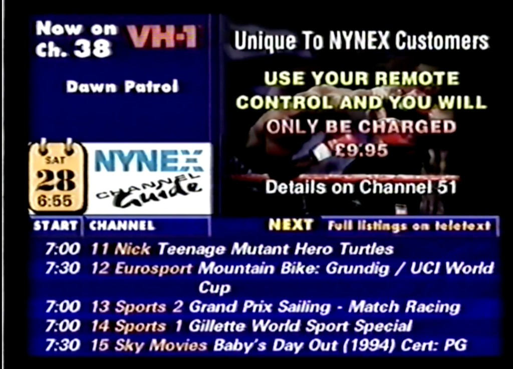
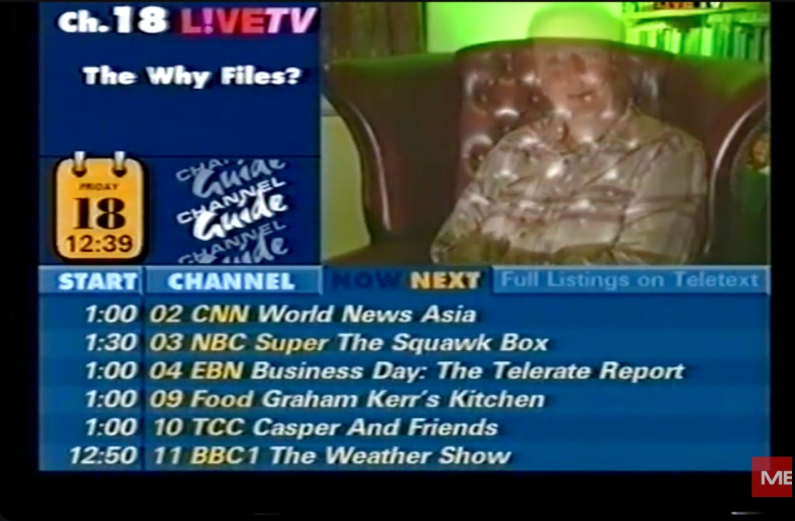

# Retro Cable Guide

A PAL-era cable TV guide recreation built with React and Vite. The UI targets a 720x576 frame and faithfully recreates the look of 1990s UK cable listings channels, loading live channel and programme data from configurable M3U and XMLTV feeds.

## Reference

The two styles are based on real 1990s UK cable guide captures:

| Nynex | Telewest |
|-------|----------|
|  |  |

## Features

- Two selectable visual styles: **Nynex** (default) and **Telewest**, toggled via config
- Configurable branding — set `guideBrand` once and the logo, promos, and launcher all update
- Logo rendered in code from config, no image asset required
- Rotating promo slideshow or live video preview, independently configurable
- Configurable preview channel rotation with wipe, blinds, and block-dissolve transitions
- Mosaic page with 12 outer live tiles, a rotating centre promo tile, and separate audio override
- Optional whole-frame CRT overlay (scanlines, vignette, phosphor bloom) for browser viewing
- Live XMLTV + M3U feed ingestion with configurable refresh interval
- TS playback via `mpegts.js`, HLS playback via `hls.js`
- 12h or 24h time formatting
- Shared grid layout ensuring `START` and `CHANNEL` headers align with listing rows

## Routes

| Path | Description |
|------|-------------|
| `/` | Branded launcher with guide and mosaic links |
| `/guide` | Retro cable guide with live listings |
| `/mosaic` | 12-tile mosaic wall with rotating centre promo |

## Getting Started

```bash
npm install
npm run dev
```

The dev server starts at `http://localhost:5175` by default.

Production build:

```bash
npm run build
```

The built output lands in `dist/` and can be served statically.

## Configuration

All settings live in [`src/config.js`](./src/config.js). Edit the `APP_CONFIG` export to customise the guide.

### Branding & Style

| Key | Default | Description |
|-----|---------|-------------|
| `guideStyle` | `"nynex"` | Visual style: `"nynex"` or `"telewest"` |
| `guideBrand` | `"cable"` | Brand name used in the rendered logo, launcher, and promo text |
| `crtEffect` | `false` | Whole-frame CRT overlay on all routes |
| `headerTagline` | `"Full listings on teletext"` | Text in the guide header's rightmost cell |

### Preview

| Key | Default | Description |
|-----|---------|-------------|
| `previewContentMode` | `"video"` | Top-right box content: `"video"` or `"promo"` |
| `previewInfoMode` | `"rotate"` | Top-left panel: `"rotate"` or `"fixed"` |
| `previewVideoMode` | `"channel"` | Large preview source: `"channel"` or `"url"` |
| `previewFixedChannel` | `null` | Pin to a specific channel number when not rotating |
| `previewVideoUrl` | `""` | Fixed preview URL override (blank = use channel stream) |
| `previewChannels` | `[401..410]` | Channel numbers for preview rotation |
| `previewCycleSeconds` | `15` | Rotation interval in seconds |
| `previewTransitions` | `[…]` | Transition effect list for the info panel |
| `previewTransitionMode` | `"random"` | `"random"` or `"cycle"` |
| `previewTransitionSeconds` | `1.2` | Transition duration |
| `previewMuted` | `false` | Whether preview video starts muted |

### Mosaic

| Key | Default | Description |
|-----|---------|-------------|
| `mosaicChannels` | `[401..412]` | Ordered channel numbers for the 12 mosaic tiles |
| `mosaicCycleSeconds` | `30` | Centre promo tile rotation interval |
| `mosaicAudioUrl` | `"…"` | Audio stream override (blank = use promo channel audio) |

### Feeds

| Key | Default | Description |
|-----|---------|-------------|
| `m3uUrl` | `"…"` | M3U playlist endpoint |
| `xmltvUrl` | `"…"` | XMLTV EPG endpoint |
| `proxyPath` | `"/api/guide"` | Local proxy path for guide data |
| `refreshMinutes` | `5` | Feed refresh interval |
| `allowedGroups` | `[…]` | M3U `group-title` values to include |
| `stripNamePrefixes` | `true` | Strip common channel name prefixes |
| `channelLimit` | `0` | Max channels (`0` = no limit) |
| `timeFormat` | `"12h"` | `"12h"` or `"24h"` |
| `fallbackToDemoData` | `false` | Use demo data if live feeds fail |

### Promos

The `promos` array in config defines the rotating promo slides. Text fields support `{brand}` tokens that resolve to the uppercase `guideBrand` at runtime:

```js
promos: [
  {
    title: "{brand} Pay Per View",
    lines: ["SATURDAY NIGHT", "BIG FIGHT LIVE"],
    highlight: "EXCLUSIVE TO CABLE",
    price: "£14.95",
    footer: "Order on Channel 51",
  },
],
```

## Data Flow

1. The Vite dev server exposes `/api/guide`.
2. That endpoint fetches the configured M3U and XMLTV feeds.
3. The app normalises the feed into a simple guide payload.
4. The listings render from the full filtered channel set.
5. The preview panel rotates independently over `previewChannels`.
6. The mosaic page resolves its own ordered `mosaicChannels` subset from the same guide payload.

## Preview Playback

- Raw TS streams are played in-browser with `mpegts.js`.
- HLS manifests are played with `hls.js`.
- Wider-than-4:3 sources are cropped to fill the retro preview window.
- The top-left info panel and the large preview window are controlled independently — `previewVideoMode: "url"` lets the guide use a fixed local/remote preview source while the info panel rotates over live channel data.
- The info panel supports configurable wipes, blinds, and block-dissolve transitions.

## Teletext

A standalone teletext page generator produces TTI files compatible with [vbit2](https://github.com/peterkvt80/vbit2) for output on a Raspberry Pi, or `.t42` files for browser-based viewers. The page layout is modelled on off-air captures of the cable channel guide service from 1999.

### Pages

| Page | Content |
|------|---------|
| 100 | Channel Guide Index (carousel if >30 channels) |
| 101–199 | Today's schedules (channel 1 = page 101, channel 42 = page 142, etc.) |
| 201–299 | Tomorrow's schedules (same mapping) |

Schedule pages use a broadcast-day model: "today" runs 06:00–06:00 (capturing the overnight tail), "tomorrow" runs midnight–midnight. Multi-page schedules carousel with "Earlier/Later programmes follow>>>>" indicators. The date header spans both days when programmes cross midnight (e.g. "Sat 23 Jan - Sun 24 Jan").

### Running

```bash
# One-shot generation
node scripts/generate-teletext.mjs --output-dir ./teletext-pages

# Long-running server (regenerates every 15 minutes)
# Point --output-dir at vbit2's pages directory for live updates
node scripts/teletext-server.mjs --output-dir /path/to/vbit2/pages --interval 15

# Compile to .t42 for browser viewers (not needed for vbit2)
node scripts/build-teletext-t42.mjs --input-dir ./teletext-pages
```

### Teletext Config

All teletext settings live in [`src/teletext/config.mjs`](./src/teletext/config.mjs):

| Key | Default | Description |
|-----|---------|-------------|
| `m3uUrl` / `xmltvUrl` | `"…"` | Feed endpoints (separate from the main guide config) |
| `allowedGroups` | `[…]` | M3U group filter |
| `serviceName` | `"TV Guide"` | Header text on all pages |
| `indexTitle` | `"THE CHANNEL GUIDE INDEX"` | Double-height title on the index page |
| `todayPageBase` | `0x100` | Today schedule pages start here |
| `tomorrowPageBase` | `0x200` | Tomorrow schedule pages start here |
| `scheduleCarouselSeconds` | `15` | Carousel cycle time for schedule pages |
| `indexCarouselSeconds` | `10` | Carousel cycle time for index pages |
| `autoSlotMap` | `true` | Auto-assign channel numbers 1–99 from M3U order |
| `channelSlotMap` | `{}` | Manual override `{ sourceNum: displayNum }` |

## Project Structure

```
src/
├── config.js                  # All runtime configuration
├── main.jsx                   # Router and launcher page
├── components/
│   ├── crt-overlay.jsx        # Shared CRT effect overlay
│   └── stream-media.jsx       # Shared TS/HLS playback component
├── guide/
│   ├── client.js              # Guide data fetcher
│   ├── xmltv.js               # XMLTV parser
│   └── demoData.js            # Fallback demo data
├── pages/
│   ├── guide-page.jsx         # Main retro guide page
│   └── mosaic-page.jsx        # Mosaic wall page
└── teletext/
    ├── config.mjs             # Teletext-specific configuration
    ├── generator.mjs           # Orchestrator: fetch feeds, match channels, generate pages
    ├── index-page.mjs          # Channel Guide Index page generator
    ├── schedule-page.mjs       # Per-channel schedule page generator
    ├── page-builder.mjs        # Layout utilities (separators, programme rows, fastext)
    └── tti-writer.mjs          # Control codes, OL line builder, page/carousel assembly
scripts/
├── generate-teletext.mjs      # CLI: one-shot .tti generation
├── teletext-server.mjs        # CLI: long-running .tti regeneration server
└── build-teletext-t42.mjs     # CLI: compile .tti → .t42
```

## Useful Commands

Transcode a browser-friendly 4:3 preview file:

```bash
ffmpeg -i video.mp4 -vf "scale=768:576:flags=lanczos,setsar=1,setdar=4/3" -c:v libx264 -crf 18 -preset slow -pix_fmt yuv420p -c:a aac -b:a 192k public/video.mp4
```

Inspect live guide data:

```bash
curl -s http://127.0.0.1:5175/api/guide
```

## Handoff

Project-specific handoff notes and design constraints live in [AGENTS.md](./AGENTS.md).
